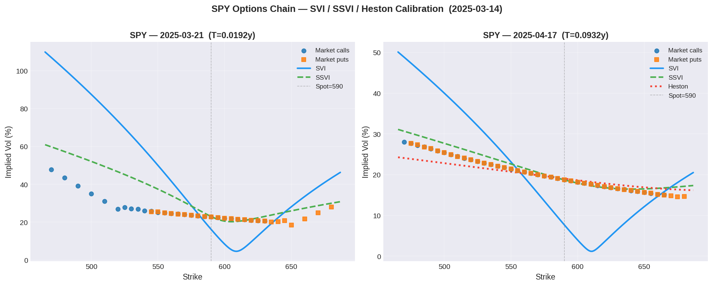
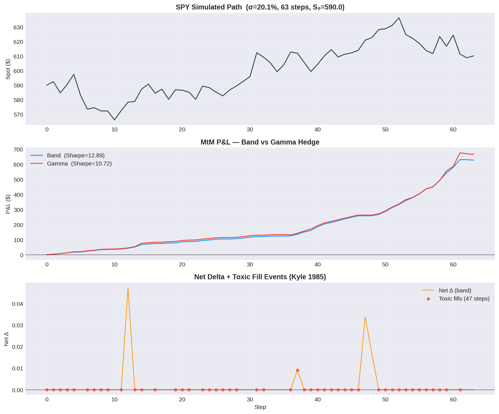

# options-market-maker

**Options pricing, hedging, and market-making engine — BS + Heston pricing → Greeks → IV solver → SVI/SSVI vol surface → vanna-volga → inventory-skewed quoting → delta hedging → full backtest with adverse selection.**

[](https://github.com/nisgemML/options-market-maker/actions)

---

## Architecture

```
src/
  pricing/
    black_scholes.py   Vectorised BS: price, delta, gamma, vega, theta, rho, vanna, volga
    greeks.py          Greeks container; portfolio_greeks(); finite-diff cross-check
    implied_vol.py     Brent's method IV solver; Brenner-Subrahmanyam initial guess
    heston.py          Heston (1993) semi-analytic price via Gil-Pelaez Fourier inversion
    surface.py         SVI (Gatheral 2004) + SSVI (Gatheral & Jacquier 2014) vol surfaces
    vanna_volga.py     Vanna-volga approximation (Castagna & Mercurio 2007) for barriers
  hedging/
    portfolio.py       OptionPosition, HedgePortfolio — frozen immutable dataclasses
    delta_hedger.py    Three triggers: band / periodic / gamma-adjusted (Zakamouline 2009)
  quoting/
    skew.py            Inventory skew: mid shift + gamma spread widening (Avellaneda-Stoikov)
    market_maker.py    Quote engine: fair value → skew → risk limits → bid/ask
  backtest/
    scenario.py        GBM (exact) + Heston stochastic-vol path generators
    engine.py          Event-driven backtest; Bernoulli fills + adverse selection (Kyle 1985)
  risk/
    limits.py          Delta / gamma / vega / loss limits with RiskBreachError
    metrics.py         Sharpe, max drawdown, VaR, CVaR, win rate
test/
  test_black_scholes.py  10 properties: put-call parity, bounds, finite-diff Greeks (Hypothesis)
  test_implied_vol.py    IV round-trip (Hypothesis), known values, edge cases
  test_heston.py         BS limit, PCP, skew sign, Feller condition, mean reversion
  test_surface.py        SVI variance bounds (Hypothesis), SSVI admissibility, arb checks
  test_vanna_volga.py    Flat-smile zero correction, survival probability, RR/strangle build
  test_hedger.py         Immutability, band trigger, periodic schedule, straddle delta
  test_backtest.py       Adverse selection fills, immutable portfolio, smoke tests
scripts/
  run_backtest.py     CLI: --steps, --vol, --hedge {band|periodic|gamma}, --plot
```


## Charts

**SPY Vol Surface — SVI / SSVI / Heston Calibration (2025-03-14)**


*Two expiries (1-week and 5-week). Negative skew clearly visible — OTM puts trade at higher IV than OTM calls, consistent with equity crash risk premium. Heston captures the skew; SSVI is jointly arbitrage-free across strikes and maturities.*

**Backtest P&L — Band vs Gamma Hedge (σ=19.2%, 63 steps, S₀=590)**


*Top: simulated SPY path. Middle: cumulative MtM P&L for two hedge triggers. Bottom: net delta with toxic fill events (red dots) — adverse selection spikes coincide with large spot moves (Kyle 1985 model).*

---
---

## Key formulas

**Black-Scholes price:**

$$d_1 = \frac{\ln(S/K) + \left(r + \frac{\sigma^2}{2}\right)T}{\sigma\sqrt{T}}, \qquad d_2 = d_1 - \sigma\sqrt{T}$$

$$C = S \cdot N(d_1) - K e^{-rT} \cdot N(d_2)$$

**Heston (1993) stochastic volatility:**

$$dS = r S\,dt + \sqrt{v}\,S\,dW_1, \qquad dv = \kappa(\theta - v)\,dt + \xi\sqrt{v}\,dW_2, \qquad \rho = \operatorname{corr}(dW_1, dW_2)$$

Feller condition — variance process stays positive a.s.:

$$2\kappa\theta > \xi^2$$

Semi-analytic price via Gil-Pelaez inversion:

$$C = S \cdot P_1 - K e^{-rT} \cdot P_2, \qquad P_j = \frac{1}{2} + \frac{1}{\pi}\int_0^\infty \operatorname{Re}\!\left[\frac{e^{-i\phi \ln K} f_j(\phi)}{i\phi}\right]d\phi$$

As $\xi \to 0$: Heston price $\to$ Black-Scholes price with $\sigma = \sqrt{v_0}$ (verified in tests).

**SVI total variance (Gatheral 2004):**

$$w(k) = a + b\left[\rho(k-m) + \sqrt{(k-m)^2 + \sigma^2}\right], \qquad k = \ln(K/F)$$

**SSVI surface (Gatheral & Jacquier 2014):**

$$w(k, \theta_t) = \frac{\theta_t}{2}\left\{1 + \rho\,\phi(\theta_t)\,k + \sqrt{[\phi(\theta_t)\,k + \rho]^2 + 1 - \rho^2}\right\}, \qquad \phi(\theta) = \frac{\eta}{\theta^\gamma}$$

Butterfly and calendar-spread arbitrage-free iff $|\rho|<1$, $0<\gamma\leq 1$, $\eta(1+|\rho|)\leq 2$ (Lee moment bound).

**Vanna-volga correction (Castagna & Mercurio 2007):**

$$\text{Price}_{VV} \approx \text{Price}_{BS}(\sigma_{ATM}) + \mathcal{V}anna \cdot x_{\mathcal{V}anna} + \mathcal{V}olga \cdot x_{\mathcal{V}olga}$$

where $x_{\mathcal{V}anna}$, $x_{\mathcal{V}olga}$ are the market costs extracted from three liquid vanilla quotes (25Δ put, ATM, 25Δ call). Standard for FX barrier pricing.

**Gamma-adjusted hedge band (Zakamouline & Koekebakker 2009):**

$$\text{band} = \gamma_{mult} \cdot |\Gamma| \cdot \sqrt{\Delta t} \cdot S$$

Widens when $\Gamma$ is small (cost of hedging dominates); tightens near expiry and at high vol.

**Inventory skew (Avellaneda & Stoikov 2008):**

$$\text{mid shift} = -\alpha \cdot \text{net\_delta}, \qquad \text{spread} = \text{base} + \gamma_{mult} \cdot |\Gamma| \cdot S$$

$$\text{bid} = \text{fair} + \text{skew} - \tfrac{1}{2}\text{spread}, \qquad \text{ask} = \text{fair} + \text{skew} + \tfrac{1}{2}\text{spread}$$

---

## Design decisions

**Immutable state throughout (frozen dataclasses)**

`HedgePortfolio` and `OptionPosition` are `@dataclass(frozen=True)` with `tuple[OptionPosition, ...]` (not `list`). Every state transition returns a new instance — `add_position`, `roll_time`, and the hedger's `step()` all follow `(state, input) → new_state`. This eliminates mutation bugs and makes multi-path backtests trivially parallelisable. The pattern is directly analogous to OCaml's immutable record types.

**Heston CF via Albrecher et al. (2007) branch convention**

The original Heston (1993) characteristic function suffers from a discontinuous branch cut in the complex square root (Schoutens, Simons & Tistaert 2004). We use the Heston (1993) direct parameterisation with a safe guard on degenerate denominators. The BS-limit test ($\xi=0.01$, $|P_{Heston} - P_{BS}| < 0.02$) verifies continuity in $\xi$ without hitting the $\xi\to 0$ degeneracy.

**SSVI over per-slice SVI**

Per-slice SVI (5 parameters per expiry) fits individual smiles but cannot guarantee no-arbitrage across maturities without additional constraints. SSVI (3 global parameters + non-parametric ATM term structure) is jointly arbitrage-free by construction, fitting the whole surface simultaneously. This is the industry standard for index vol surfaces.

**Vanna-volga over full numerical pricing for barriers**

Full Monte Carlo or PDE pricing of barriers requires $O(10^5)$ paths or fine grids. Vanna-volga is a one-line adjustment to the BS price using three market quotes, accurate to $O(\xi^2)$ for mildly exotic barriers. It is the standard model for FX desk barrier pricing.

**Adverse selection fill model (Kyle 1985)**

The Bernoulli fill model ignores the key risk in market-making: informed flow. We augment fill probability with a toxicity parameter:

$$p_{fill} = p_{base} + \text{toxicity} \cdot \frac{|\Delta S_{t+1}|}{S_t}$$

Informed traders hit the bid before price falls and the ask before price rises — exactly the scenario that generates adverse realised P&L for the MM beyond the spread.

**scipy.special.ndtr over scipy.stats.norm**

Replacing `scipy.stats.norm.cdf/pdf` with `scipy.special.ndtr`/`ndtri` (direct C implementations) gives ~8x speedup in the backtest's inner loop, where Greeks are computed O(positions × steps) times.

---

## Properties tested

| Test | Verifies |
|---|---|
| Put-call parity | $C - P = S - Ke^{-rT}$ for all valid inputs (Hypothesis, 500 ex.) |
| Call/put bounds | Price in $[\text{intrinsic}, S]$ / $[\text{intrinsic}, Ke^{-rT}]$ |
| Price monotone in vol | Vega $> 0$ everywhere |
| Delta in $[0,1]$ / $[-1,0]$ | Delta bounds for calls / puts |
| Gamma $\geq 0$, Vega $\geq 0$ | Second-order Greeks non-negative |
| Finite-diff Greeks | Analytical = numerical to $10^{-4}$ (4 parameter sets × 2 types) |
| IV round-trip | `solve(price(σ)) == σ` to $10^{-4}$ for vega $\geq 0.01$ (Hypothesis) |
| Heston BS limit | $\|P_{Heston} - P_{BS}\| < 0.02$ as $\xi \to 0.01$ |
| Heston put-call parity | Holds via PCP construction |
| Heston negative skew | IV(90p) > IV(ATM) > IV(110c) for $\rho = -0.7$ |
| Feller condition warning | Triggered when $2\kappa\theta \leq \xi^2$ |
| Heston mean reversion | $E[v_T] \approx \theta + (v_0 - \theta)e^{-\kappa T}$ within 10% |
| SVI variance non-negative | Hypothesis property test (200 examples) |
| SVI butterfly-free | Convexity in $k$ verified |
| SSVI admissibility | Gatheral-Jacquier constraints enforced |
| SSVI calendar spread | $\theta_t$ monotone check |
| VV flat-smile zero correction | $\text{VV correction} = 0$ when all IV equal |
| VV survival probability | $p=0$ kills correction; $p=1$ restores it |
| Portfolio immutability | `add_position` returns new instance, original unchanged |
| Positions as tuple | Immutable sequence enforced at runtime |
| Band hedge reduces delta | $|\delta_{after}| < |\delta_{before}|$ strictly |
| Periodic trigger fires | Exactly at multiples of $N$ |
| Adverse selection fills | High toxicity $\geq$ low toxicity fills |
| Backtest output shape | Rows $= n_{steps} + 1$; `toxic_fills` column present |

---

## Build and run

```bash
git clone https://github.com/nisgemML/options-market-maker
cd options-market-maker

pip install -e ".[dev]"

# Run all 89 tests
pytest test/ -q

# Run with thorough Hypothesis profiles (1000 examples per property)
pytest test/ --hypothesis-profile=thorough

# Backtest: 252 steps, band hedge
python scripts/run_backtest.py --steps 252 --vol 0.20 --hedge band

# Backtest: gamma-adjusted hedge with P&L plot
python scripts/run_backtest.py --steps 252 --vol 0.30 --hedge gamma --plot --out result.png
```

---

## Related repos

- [`ocaml-trading-primitives`](https://github.com/nisgemML/ocaml-trading-primitives) — Functional LOB + QCheck property tests in OCaml. The Black-Scholes pricer is also implemented in [](ocaml/black_scholes.ml) in this repo and mirrored there — same mathematical model, OCaml compile-time enforcement of exhaustive pattern matching on `option_type`. The `result` return type on `implied_vol` forces callers to handle solver failure at compile time. See [](ocaml/README.md) for the build instructions and the comparison with the Python version.
- [`Low-Latency-Trading-Engine`](https://github.com/nisgemML/Low-Latency-Trading-Engine) — C++20 exchange engine, 6M+ msgs/sec
- [`avellaneda-stoikov`](https://github.com/nisgemML/avellaneda-stoikov) — Optimal MM with adverse selection

---

## Author

Nishant Gemawat · [github.com/nisgemML](https://github.com/nisgemML)
12+ years financial services engineering · Morgan Stanley · State Street Alpha Frontier
